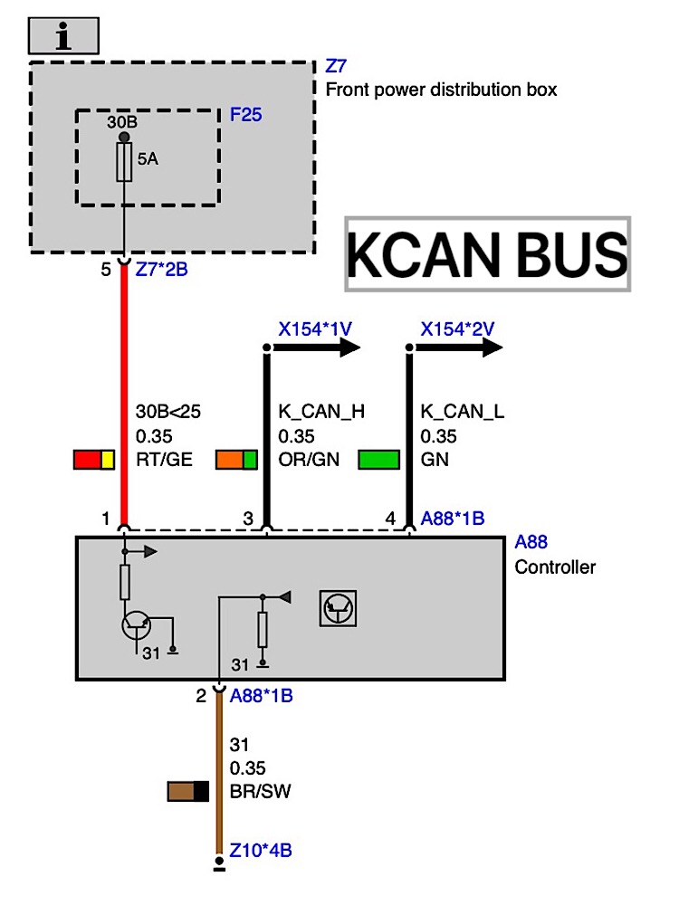
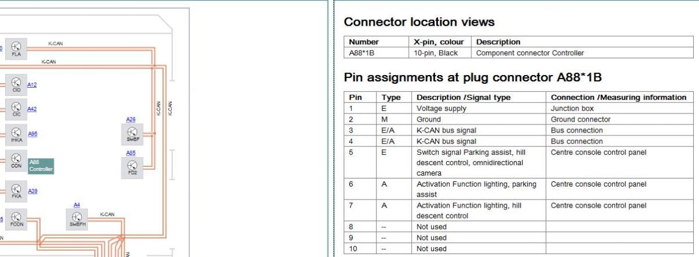
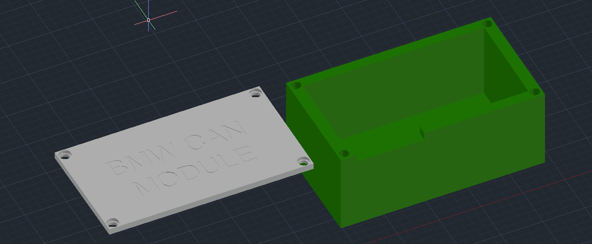
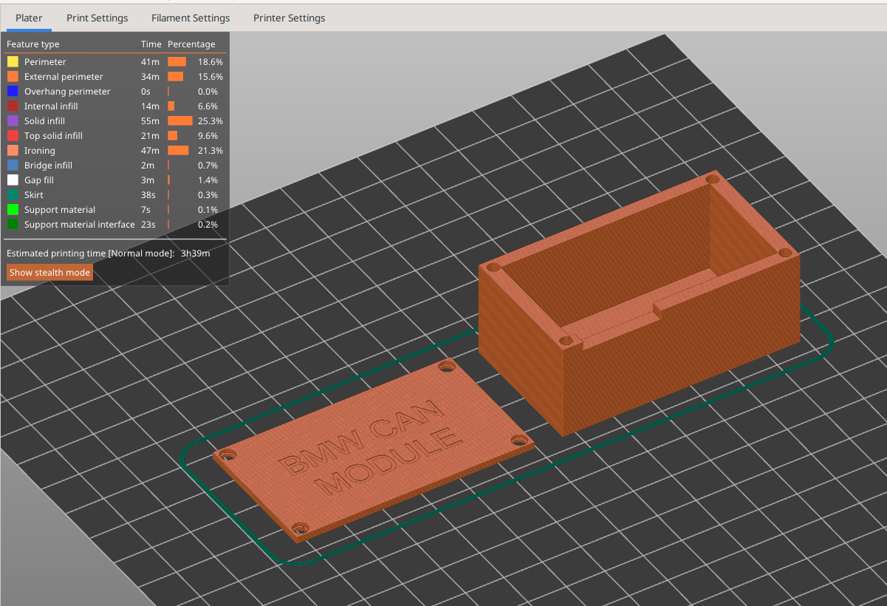
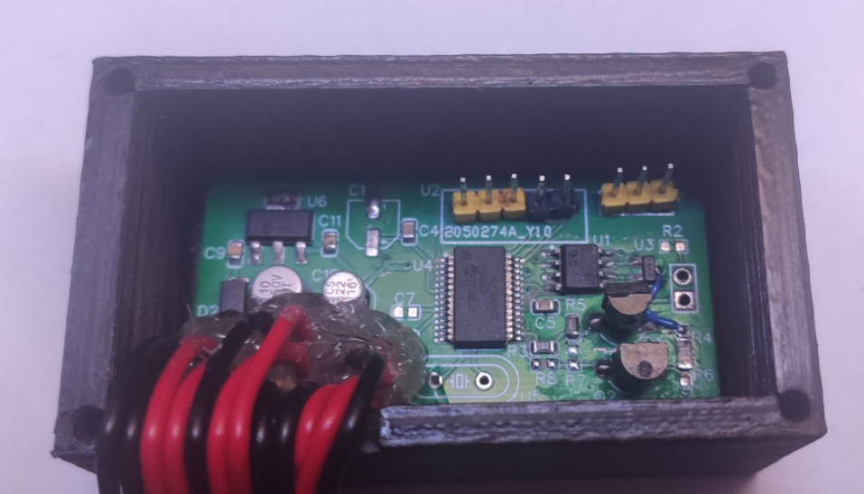
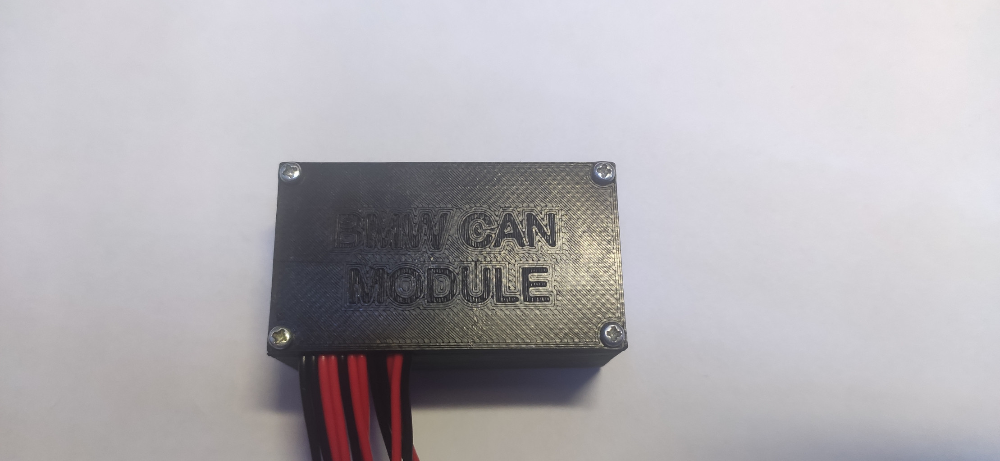

# BMW CAN Module

Just really simple CAN BUS device based on PIC18LF26K80 to emulate PDC/HDC/CAM commands.

BMW F Series cars up to 2011-06 (I think) had I-Drive (ZBE) controllers with 10-pin plugs. After 2011-07 BMW started to use controllers with 4-pin plugs.

ZBE communicates through CAN BUS (K-CAN) using 2 wires and it needs 2 wires for power. Then 1 wire (ADC) is used for PDC/HDC/CAM buttons and 1 or 2 wires for PDC and/or HDC LED lights. Which means that 10-pin ZBE also sends messages to K-CAN when PDC/HDC/CAM button is pressed and lights up appropriate LED light.

Once you plug-in 4-pin K-CAN ZBE, you will no longer have these buttons working nor LED lights. For this purpose I made a really simple emulator - to read ADC keys and send messages once pressed, and of course, control PDC/HDC "active" LED lights.

**Note: At the moment only PDC functionality is supported. I do not have CAN frames for HDC/CAM control, yet.**

# CAN BUS, K-CAN, K-CAN2, ...

BMW just calls CAN BUS `K-CAN`, that is pretty much it. Now K-CAN runs at 100Kbps speed while K-CAN2 and others, K-CAN3/K-CAN4 runs at 500Kbps.

# Hardware

I needed low-powered MCU with CAN peripheral. I am quite familiar with Atmel AVR MCU devices as well as with STMicroelectronics STM32F10x devices.

However, Atmel does not seem to have AVR with CAN peripheral and something like STM32F103 would be really overkill for such a simple device. Also initially I thought that PDC/HDC LED lights are powered by 5V (12V actually) so I thought there is no point to use 3.3V MCU - I will need 12V -> 3.3V and 12V -> 5.0V voltage converters.

Then I looked into Microchip PIC devices and found PIC18LF26K80 in stock. I have not used any PIC device before at all, so it was my first time programming it and using Microchip's IDE.

For 12V -> 5.0V converter I have used MCP170 and for CAN transceiver - MCP2551. A few NPN and PNP transistors (S8050, S8550) to control PDC/HDC LED outputs. I have also added CAN ESD protection diode called PESD2CAN, just in case.

# Firmware

I have used MPLAB IDE and PicKit 3.

It reads button states by reading ADC value periodically. Once key is released, PIC will send  a message through K-CAN to let others (CIC, etc) know that PDC should be turned on.

When PDC is turned on (via reverse gear or message from PIC) some car other module will transmit message that PDC is really active. PIC will listen for that message too, to control PDC LED output.

And of course, I have enabled sleep mode. PIC will wake up on CAN activity and will listen for "terminal on" message for about 5 seconds before going to sleep again. Once such message is received, it will continue to stay awake until "terminal off" command is received, then PIC will enter sleep mode again.

# Power consumption, sleep mode

I measured 0.035mA current consumption in sleep mode. Keep in mind, this is MCP170 + MCP2551 CAN transceiver in stand-by mode and PIC itself. For comparison, 10-pin ZBE uses about 1.45mA in sleep mode.

If PIC is not sleeping then it will use about 12.5mA, this is without LED outputs, and ZBE seem to use 85.5mA current.

# Wiring

I have used 4-pin connectors `BMW 1452576` (1 male and 2 females) and this made it to be Plug'n'Play. You can find these in eBay, AliExpress, etc.

This is the wiring for 4-pin ZBE:

And this is for 10-pin ZBE:

Note: 3-pin is CAN_HIGH and 4-pin is CAN_LOW on both variants.

As you can see you can use 4-pin ZBE instead of 10-pin, but you will loose functionality of PDC/HDC/CAM buttons and LED outputs.

# Rest

I am publishing everything what is needed to build such a device - schematics, firmware source and enclosure to 3D print. I have used EasyEDA to draw schematic and PCB, look up in `hardware` directory.

I might work on v2 version where will be 2 CAN peripherals, one is at 100Kbps and other is at 500Kbps. The latter would allow to use even newer ZBE controllers since they use K-CAN2 in NBT infotainment system and you cannot just connect K-CAN to K-CAN2/3/4, it will simply would not work due to different speeds.

In the following pictures you can see first version of the board where I made some mistakes and fixed them using Kynar wires. I am publishing updated v1.1 schematic and PCB where those mistakes should be fixed.

